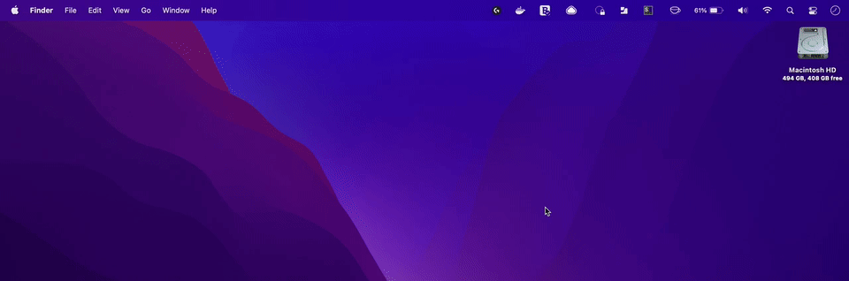
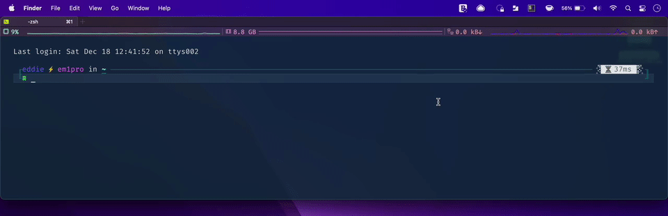
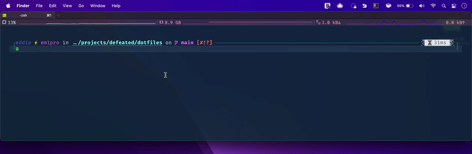

# my dotfiles

A set of common configuration files I use under macOS for things like customizing
the shell, ruby, node, git, etc.

## Usage

  1. create `.env` file (`cp .env.example .env`) and fill in secrets
  2. run `./install.sh`

## Terminal Prompt

  * git status (if dir is a repo)
  * current ruby & node versions (if any)
  * current aws profile & region (if any)
  * duration of last command
  * zsh autcompletion & suggestions
  * zsh syntax highlighting
  * iTerm CPU/MEM/NET usage
  * summon on any display or virtual desktop with <kbd>cmd</kbd> + <kbd>~</kbd>

### Examples

#### Hotkey

#### Suggestions

#### Syntax highlighting and errors

